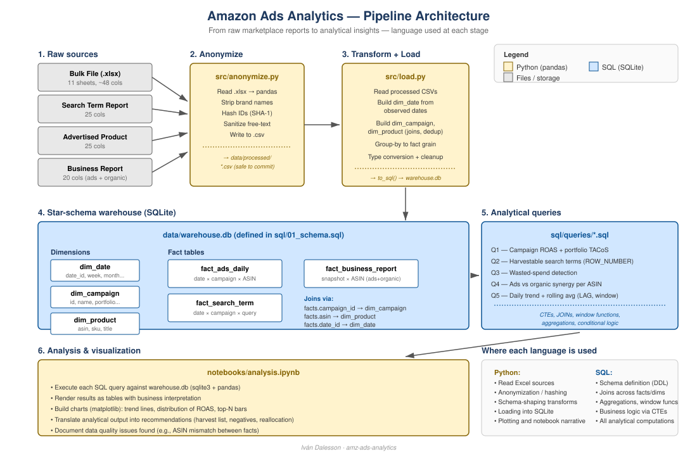
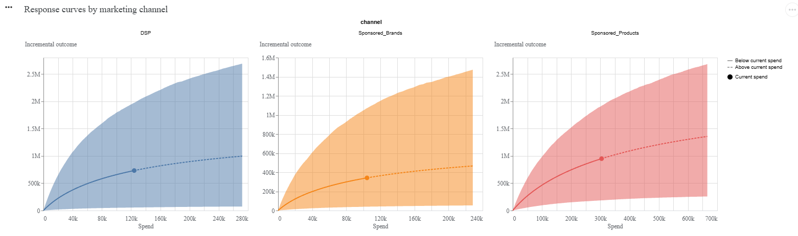
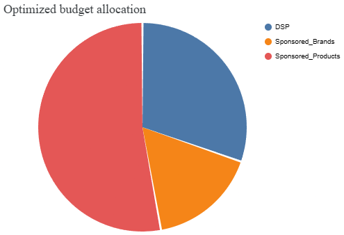
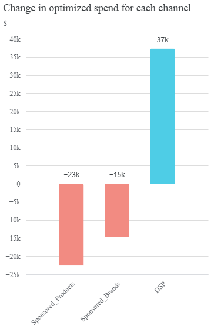

# Amazon Ads Analytics — dbt/BigQuery Warehouse + Marketing Mix Model

A data engineering and analytics project that takes raw Amazon Advertising reports
(in Excel), anonymizes them, and models them into a star-schema warehouse in two
parallel implementations: a **dbt + BigQuery Analytics Engineering layer**
(staging → marts, tested and documented — see [`amazon_ads_dbt/`](amazon_ads_dbt/))
and the original **SQLite prototype** below, which also feeds a
**Marketing Mix Model** to decompose sales attribution and optimize budget
allocation across channels.

## Analytics Engineering layer — dbt + BigQuery

The production-shaped version of this warehouse lives in
[`amazon_ads_dbt/`](amazon_ads_dbt/): the same four Amazon report sources,
modeled as dbt staging → marts layers running against BigQuery, with data
tests on every model (`unique`, `not_null`, `relationships`, and a
`dbt_utils.unique_combination_of_columns` grain test) and a
`fact_weekly_channel_performance` mart for trend reporting by ad product
(SP/SB/SD). See that folder's own README for the model list, lineage, and
how to run it — that's the piece most relevant if you're evaluating this repo
for an **Analytics Engineer** role specifically.

## Architecture (SQLite prototype + MMM)



| Stage | Language | Module |
|---|---|---|
| 1. Read raw .xlsx reports | Python (pandas) | `src/anonymize.py` |
| 2. Strip brand names, hash IDs, write CSV | Python | `src/anonymize.py` |
| 3. Transform to schema-shaped tables | Python | `src/load.py` |
| 4. Define warehouse schema | SQL (DDL) | `sql/01_schema.sql` |
| 5. Load tables into SQLite | Python + SQL | `src/load.py` |
| 6. Analytical queries | SQL | `sql/queries/*.sql` |
| 7. Notebook narrative & charts | Python (pandas, matplotlib) | `notebooks/analysis.ipynb` |
| 8. MMM data preparation | Python | `src/mmm_prep.py` |
| 9. MMM model + budget optimizer | Python (scikit-learn, scipy) | `notebooks/mmm_model.ipynb` |
| 10. Bayesian MMM (Google Meridian) | Python (Meridian, TFP) | `notebooks/meridian_mmm_amazon_ads.ipynb` |

---

## Data sources

Four Amazon report types feed the warehouse:

- **Bulk file** — the master campaign structure (Portfolios, Campaigns, Ad Groups, Keywords, Product Ads). Multi-sheet Excel.
- **Search Term Report** — every customer search query that triggered an ad, with performance.
- **Advertised Product Report** — per-ASIN ad performance.
- **Business Report** — total sales (ads + organic) at the ASIN level. The piece that lets us compute TACoS.

Raw files are **not** committed (they contain identifiable brand data even
after anonymization). The anonymized CSVs in `data/processed/` are safe
to commit and reproduce the warehouse.

---

## Schema

A star schema with three fact tables (different grains) and three shared dimensions:

- `dim_date`, `dim_campaign`, `dim_product`
- `fact_ads_daily` — date × campaign × ASIN grain
- `fact_search_term` — date × campaign × search-query grain
- `fact_business_report` — snapshot × ASIN grain (ads + organic sales)

Schema is defined in `sql/01_schema.sql` and is dialect-agnostic
(developed on SQLite, will run on PostgreSQL or any analytical engine).

---

## Analytical queries

Each query in `sql/queries/` answers a concrete business question. They
demonstrate JOINs across facts and dimensions, CTEs for staged logic,
window functions (`ROW_NUMBER`, `LAG`, rolling averages), and conditional
aggregation.

| File | Question | Techniques |
|---|---|---|
| `01_campaign_roas_tacos.sql` | Which campaigns are most efficient on their own ROAS — and how do they look against total business sales (TACoS)? | CTEs, cross-join, aggregation |
| `02_harvestable_search_terms.sql` | Which broad/auto search terms have converted profitably and should be promoted to exact-match campaigns? | `ROW_NUMBER`, partitioned ranking |
| `03_wasted_spend.sql` | Which search terms are burning budget without converting? Candidates for negative keywords. | Conditional logic, filtering on aggregates |
| `04_ads_vs_organic_synergy.sql` | For each product: what share of sales is from ads vs organic? Where is ad dependency too high? | Multi-fact join, label classification |
| `05_daily_trend_anomalies.sql` | Daily spend and ROAS trend with rolling 7-day average and anomaly flags. | `LAG`, window functions, rolling averages |

---

## Marketing Mix Model

`src/mmm_prep.py` + `notebooks/mmm_model.ipynb`

The MMM layer sits on top of the warehouse and answers the question that
no last-click attribution model can: **what actually caused the sales?**

### What it does

1. **Data prep** (`src/mmm_prep.py`) — pulls weekly aggregated spend and
   sales from the warehouse, applies adstock and Hill saturation transforms,
   and generates a synthetic 2-year dataset (see note below).

2. **Model** (`notebooks/mmm_model.ipynb`) — fits an OLS regression with
   transformed channel spend as features, decomposes total sales into
   baseline organic + channel contributions + seasonality, and runs a
   budget optimizer via `scipy.optimize`.

3. **Outputs** — five charts saved to `data/mmm/`:

| Chart | What it shows |
|---|---|
| `01_eda_overview.png` | Weekly spend by channel, total vs organic sales, TACoS trend, spend/sales scatter |
| `02_sales_decomposition.png` | Stacked area of sales by source + attribution pie chart |
| `03_response_curves.png` | Diminishing returns curve per channel with marginal return at current spend |
| `04_budget_optimizer.png` | Current vs recommended budget allocation (same total spend) |
| `05_actual_vs_predicted.png` | Model fit — actual vs predicted with R² and MAPE |

### Key results (synthetic dataset)

| Channel | Sales attribution | Marginal return at avg spend |
|---|---|---|
| Baseline organic | 47.4% | — |
| Sponsored Products | 41.7% | $3.40 per $1 |
| Sponsored Brands | 7.8% | $1.67 per $1 |
| DSP | 3.0% | $0.70 per $1 |

Model fit: **R² = 0.995 · MAPE = 2.32%**

### Note on data

> The sample dataset covers ~5 weeks — insufficient for causal MMM inference
> (minimum 52 weeks recommended). `src/mmm_prep.py` generates a realistic
> 2-year synthetic dataset with known ground-truth parameters, allowing full
> model validation. The pipeline, transforms, and model code are
> production-ready: swap in real data with ≥52 weeks and re-run.

### MMM transforms

- **Adstock (geometric decay)** — models the carry-over effect of advertising.
  SP decay=0.5, SB decay=0.3, DSP decay=0.7 (DSP has highest brand awareness persistence).
- **Hill saturation** — models diminishing returns as spend increases.
  Half-saturation points: SP=$3000, SB=$1500, DSP=$1000.

### Production improvements (not in scope here)
- Grid search to optimize adstock and saturation parameters in the OLS
  model (currently fixed) — MCMC posterior sampling for uncertainty
  quantification is already done, see the Google Meridian section below
- External regressors: price index, competitor activity, macro indicators
- Minimum spend constraints in budget optimizer per channel
- Orchestration via Airflow DAG

---


---

## Bayesian Marketing Mix Model — Google Meridian

[](https://colab.research.google.com/github/ivandalss/amazon-ads-data-pipeline/blob/main/notebooks/meridian_mmm_amazon_ads.ipynb)

`notebooks/meridian_mmm_amazon_ads.ipynb`

An extension of the OLS MMM layer using **Google Meridian** — the industry-standard
open-source Bayesian MMM framework. While the OLS model gives point estimates,
Meridian uses **MCMC (No-U-Turn Sampler)** to produce full posterior distributions,
quantifying uncertainty for every estimate.

### Why Bayesian over OLS

| | OLS MMM | Bayesian MMM (Meridian) |
|---|---|---|
| ROI output | Single point estimate | Full posterior distribution |
| Uncertainty | None | 90% credible intervals |
| Prior knowledge | Not possible | Inject via priors |
| Short data histories | Unstable | Stabilized by priors |
| Industry standard | Legacy | Current standard (Meridian, Robyn, PyMC) |

### What the notebook does

1. **Data prep** — builds a 104-week synthetic dataset matching the warehouse channels (SP, SB, DSP) with known ground-truth parameters
2. **InputData** — formats data into Meridian's `xr.DataArray` format with correct dimension names
3. **Model config** — sets `LogNormal(0.2, 0.9)` ROI priors, consistent with e-commerce channel benchmarks
4. **Prior sampling** — verifies prior behavior before fitting
5. **Posterior sampling** — runs MCMC (4 chains, 500 adapt + 500 burnin + 1000 kept samples) on GPU
6. **Response curves** — visualizes diminishing returns per channel with credible intervals
7. **Budget optimizer** — recommends optimal budget reallocation at same total spend

### Key results

| Channel | Median ROI | 90% Credible Interval |
|---|---|---|
| Sponsored Products | $2.93 / $1 | $0.61 — $6.30 |
| Sponsored Brands | $2.11 / $1 | $0.38 — $10.26 |
| DSP | $4.08 / $1 | $0.44 — $15.87 |

> Wide CIs reflect genuine uncertainty with synthetic data. In production with 52+ weeks of real data and independent spend variation across channels, intervals narrow significantly.

### Response curves by channel



*Shaded area = 90% credible interval. Dot = current spend level. Curve flattening = saturation.*

### Optimized budget allocation



### Recommended spend change vs current



*Meridian recommends shifting $37k from SP/SB toward DSP, consistent with DSP's higher median ROI and remaining headroom on its response curve.*

### How to run

The notebook requires a GPU for MCMC sampling (~10-15 min on T4). Open directly in Colab:

[](https://colab.research.google.com/github/ivandalss/amazon-ads-data-pipeline/blob/main/notebooks/meridian_mmm_amazon_ads.ipynb)

## How to run

Prerequisites: Python 3.11+, `pip install -r requirements.txt`.

```bash
# 1. Place raw .xlsx files in data/raw/
# 2. Anonymize:
python src/anonymize.py
# 3. Build warehouse:
python src/load.py
# 4. Ads analytics notebook:
#    Open notebooks/analysis.ipynb and run all cells.

# 5. MMM prep (generates synthetic data if warehouse is empty):
python src/mmm_prep.py
# 6. MMM model + optimizer:
#    Open notebooks/mmm_model.ipynb and run all cells.
```

End-to-end runtime on the sample dataset: ~15 seconds.

---

## What this project demonstrates

- **ETL fundamentals:** multi-source ingestion, schema design, idempotent
  loads, separation of raw / processed / warehouse layers.
- **SQL fluency:** CTEs, window functions, multi-fact joins, conditional
  aggregations across a real star schema.
- **Data-quality awareness:** anonymization layer, deterministic ID
  hashing (joins still work), documented mismatches (e.g., Parent vs
  Child ASIN coverage between facts).
- **Marketing measurement thinking:** TACoS vs ACoS, keyword harvesting,
  negative keywords, ads-vs-organic synergy — real questions from agency life.
- **MMM methodology:** adstock transforms, Hill saturation, OLS decomposition,
  budget optimization via constrained numerical optimization.
- **Engineering trade-offs:** SQLite for portability in this MMM
  prototype (the warehouse migration to BigQuery is done, in
  `amazon_ads_dbt/` — not yet wired into the MMM notebooks), no
  orchestration for a 2-script pipeline (Airflow DAG in production),
  synthetic data with documented limitations.

---

## What's intentionally not in scope (and why)

These apply to the SQLite/MMM side of the repo described below. The
managed-warehouse gap is actually closed — see
[`amazon_ads_dbt/`](amazon_ads_dbt/) for the same warehouse running on
BigQuery with dbt, tests, docs, and CI; it just isn't what feeds the MMM
notebooks yet (see "Why this exists" in that folder's README).

- **No orchestration tool (Airflow/Prefect):** two scripts run in order is
  fine for a 4-source pipeline. In production, this would be a DAG.
- **No streaming:** marketplace reports are batch by nature.
- **No geo-level MMM:** national-level model used for simplicity. Meridian supports full geo-hierarchical modeling when geo-level data is available.

---

## File structure

```
.
├── README.md
├── requirements.txt
├── .github/
│   └── workflows/
│       └── dbt_ci.yml        # dbt build (run + test) on push, keyless GCP auth via WIF
├── amazon_ads_dbt/           # dbt + BigQuery Analytics Engineering layer — see its own README
│   ├── README.md
│   ├── models/
│   │   ├── staging/
│   │   └── marts/
│   └── ...
├── docs/
│   └── architecture.svg
├── src/
│   ├── anonymize.py          # PII stripping + deterministic hashing
│   ├── load.py               # ETL → SQLite warehouse
│   └── mmm_prep.py           # Weekly aggregation + synthetic data generator
├── sql/
│   ├── 01_schema.sql
│   └── queries/
│       ├── 01_campaign_roas_tacos.sql
│       ├── 02_harvestable_search_terms.sql
│       ├── 03_wasted_spend.sql
│       ├── 04_ads_vs_organic_synergy.sql
│       └── 05_daily_trend_anomalies.sql
├── notebooks/
│   ├── analysis.ipynb        # SQL analytics narrative + charts
│   ├── mmm_model.ipynb       # OLS MMM model, decomposition, budget optimizer
│   └── meridian_mmm_amazon_ads.ipynb  # Bayesian MMM with Google Meridian (run in Colab)
└── data/
    ├── raw/                  # .gitignored — identifiable .xlsx files
    ├── processed/            # anonymized .csv — safe to commit
    ├── mmm/                  # weekly_synthetic.csv + output charts
    └── warehouse.db          # .gitignored — rebuild with python src/load.py
```
